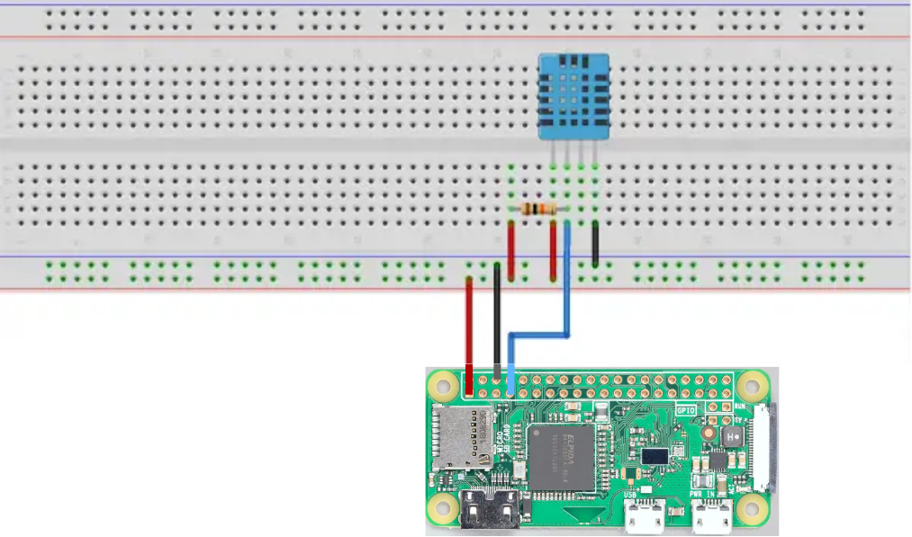
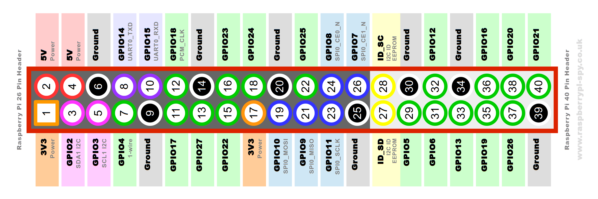

# Temperature and Humidty Sensor
This project uses a DHT22 sensor connected to a Raspberry Pi Zero W to capture temperature and humidity measurements. The information is published over WLAN to a [MQTT](https://mqtt.org/) broker and displayed in [Homeassistant](https://www.home-assistant.io/).

The configuration of this MQTT client and topics should be set in [config.json](https://github.com/ptr33/temp_humidity_sensor/blob/main/config.json). A MQTT broker should already be running - example in https://mosquitto.org/


## References

Initial work from
- https://github.com/adafruit/Adafruit-Raspberry-Pi-Python-Code/tree/legacy/Adafruit_DHT_Driver
- https://www.airspayce.com/mikem/bcm2835/


## Raspberry PI Zero W setup

Create an image with [Raspberry PI Imaging Utility](https://www.raspberrypi.com/news/raspberry-pi-imager-imaging-utility/).
Setup hostname, wifi access, username, password and locale.

Connect Raspberry to DHT22 sensor ([reference](https://github.com/FranzTscharf/Python-DHT22-Temperature-Humidity-Sensor-Raspberry-Pi)):


GPIO pins:



### Install Tool

On the Raspberr Pi Zero W execute the following comands:
```bash
git clone https://github.com/ptr33/temp_humidity_sensor.git
cd temp_humidity_sensor/
pip install -r requirements.txt --break-system-packages
git update-index --assume-unchanged config.json
```

Then edit server settings, topics and hardware configuration in [config.json](https://github.com/ptr33/temp_humidity_sensor/blob/main/config.json)

To run the script use:
```bash
./getreading.py
```

### Crontab

To execute the script every 10 minutes, use crontab:
```bash
crontab -e
# add below lines to crontab, if you use nano, use ^O<Enter>^X to install
# run every 10 minutes
*/10 * * * * cd ~/temp_humidity_sensor/ && ./getreading.py
```


### Compile Adafruid_DHT binary (optional) 

```bash
cd ~/temp_humidity_sensor/bcm2835_lib/bcm2835-1.75
./configure
make
sudo make install
cd ../../Adafruit_DHT_Driver
make
make test
make clean
```
The library was tested on a Raspbery Pi Zero W (first version) -
if you want to use the driver on a different device, you might need to modify [LOW_HIGH_THRESHOLD](https://github.com/ptr33/temp_humidity_sensor/blob/dev/Adafruit_DHT_Driver/Adafruit_DHT.c#L31)


#### Test

```bash
cd ~/temp_humidity_sensor/Adafruit_DHT_Driver
sudo ./Adafruit_DHT 22 4
```
The output should be:
```
ptr@raspberrypi:~/temp_humidity_sensor/Adafruit_DHT_Driver $ sudo ./Adafruit_DHT 22 4
Using pin #4
Data (40): 0x2 0x17 0x0 0xe1 0xfa
Temp =  22.5 *C, Hum = 53.5 %
```


## Integrate with Homeassistant

Create a MQTT client in [Homeassistant](https://www.home-assistant.io/) for the same MQTT server as used for publishing (configured config.json). Then edit the following files:

*configuration.yaml*
```yaml
mqtt: !include mqtt.yaml
```

*mqtt.yaml*
```yaml
sensor:
  - name: "Temperature"
    state_topic: "stat/room/temperature"
    state_class: measurement
    unit_of_measurement: "°C"
    device_class: temperature
  - name: "Humidity"
    state_topic: "stat/room/humidity"
    state_class: measurement
    unit_of_measurement: "%"
    device_class: moisture
  - name: "Dewpoint"
    state_topic: "stat/room/dewpoint"
    state_class: measurement
    unit_of_measurement: "°C"
    device_class: temperature
```

Reload the configuration or restart homeassistant server for the new devices to appear.
