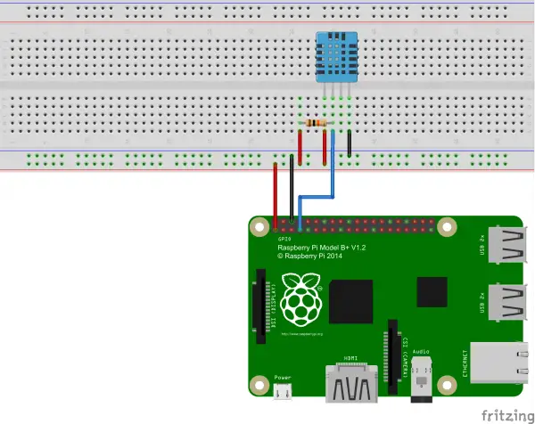

# Temperature and Humidty Sensor
Temperature and Humidity Sensor

# Sources
Copied from 
- https://github.com/adafruit/Adafruit-Raspberry-Pi-Python-Code/tree/legacy/Adafruit_DHT_Driver 
- https://github.com/adafruit/Adafruit-Raspberry-Pi-Python-Code/tree/legacy/Adafruit_DHT_Driver_Python

# Raspberry PI Zero setup

Created image with following [Raspberry PI Imaging Utility](https://www.raspberrypi.com/news/raspberry-pi-imager-imaging-utility/).
Setup hostname, wifi access name and locale.

Connection to DHT22 sensor ([reference](https://github.com/FranzTscharf/Python-DHT22-Temperature-Humidity-Sensor-Raspberry-Pi)):

